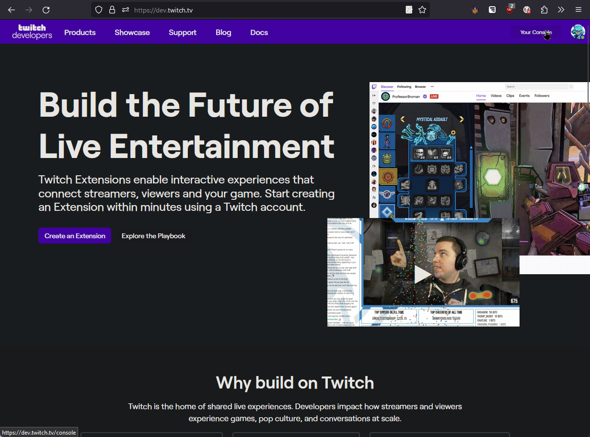
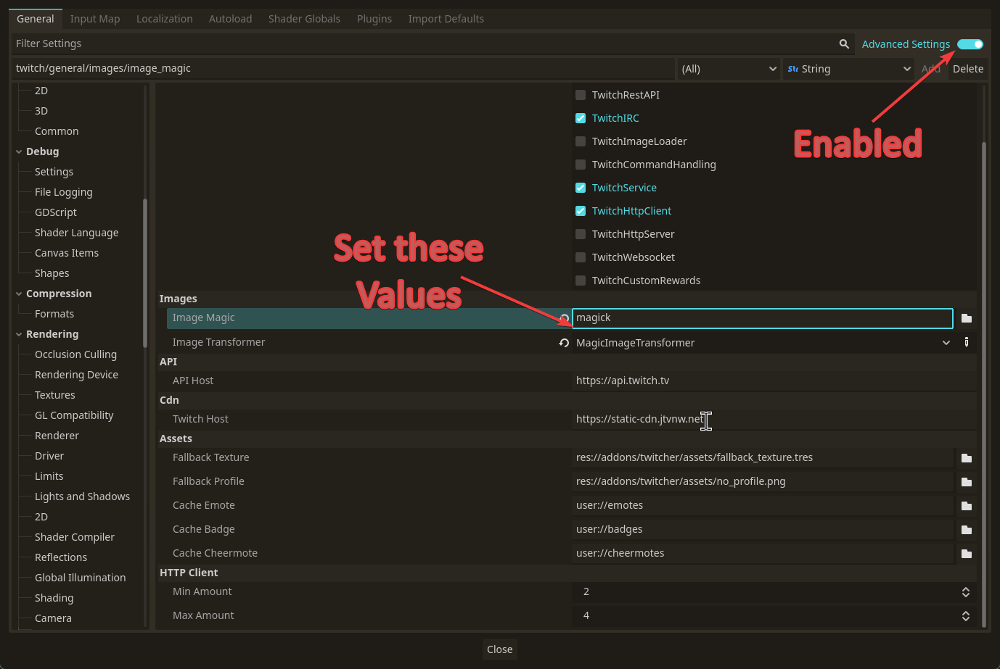

# [Beta] Twitcher
.. is a Godot Library for implementing Twitch functionality in Godot.
The main purpose is to use this library for easier overlay development.
The library can also be used to support Twitch game integration.

## Features
- Integration of Authorizationsflows (Auth Code, Client Credentials, Device Code, ~~Implicit~~)
- Configuration driven approach. Almost all feature can be configured and used afterwards. But programatically approach is also supported.
  - Auth Credentials
  - Requested Auth Scopes
  - Subscribed events for EventSub. All possible events with their needed configurations.
  - ...
- Easy integration of chat support via Node `TwitchIrcChannel`
- Easy integration of event sub via Node `TwitchEventListener`
- Complete REST Api (provided by [https://twitch-api-swagger.surge.sh/](https://twitch-api-swagger.surge.sh/)) with data classes for type safety
- Cheer Emote parsing
- Command Handler for easy implementing custom commands
- Handles low level integration of websocket and http requests for you that is fully compatible with the Twitch Docs
- GIF support for emojis via ImageMagick (other options are planned)

**Secondary Features**
- BufferedHttpClient to request multiple requests to the same API without manual orchestration, handles automatical reconnect
- Simple load balanced HTTP Client: HTTP request in parallel
- Simple Websocket Client with auto reconnect
- GIF to SpriteFrame importer
- Simple Logger to enable and disable logging for modules
- Simple generator for the Twitch REST Api in case of changes (maybe a good base for other Swagger APIs too, maybe not cause the code generator is trash and hold together with duct tape)
- A RichTextEffect to positioning SpriteFrames within a RichTextLabel (easy to extend to support positioning everything within a RichTextLabel)

Most of the features are implemented. Bugs are very likely, cause of the amount of generated code.

## Install
*Upfront information: You will stumble over a `Redirect URL`. This URL has to point to your PC / Application that the authorization is redirected after the login.
In case you have no clue just use `http://localhost:7170` and make sure this is the redirect URL in `https://dev.twitch.tv` and your settings in Godot at `Twitch -> Auth -> redirect_url`*

1. Checkout the project into your addon folder or use the AssetLib. **Important: The path has to be `/addons/Twitcher` otherwise the internal paths doesn't work anymore.**
   Tries to make the path relative didn't worked 😒
2. Then enable the Plugin via `Project -> Project Settings -> Plugins`
3. Insert your credentials: `Project -> Project Settings -> Twitch -> Auth`
   Insert client credentials, find them at [Twitch Dev Console](https://dev.twitch.tv/) use the [guide](https://dev.twitch.tv/docs/authentication/register-app/)
	  
   	  Note: for the goblins the secret is invalidated ;)
4. Call `TwitchService.setup();` at some point in your application when you want to start the Twitch integration. See also the examples

## Image Transformer

**TwitchImageTransformer**
Is the default transformer for all projects. It doesn't support animation at all and returns static images instead.
Version that always should work.

**MagickImageTransformer**
Cause Godot doesn't support GIF by default the library provides a possibility for exchangeable converter.
Not everyone needs the GIF support. At default the library doesn't use GIF's and requests only static Emojis.
The Converter that is provided by the Lib requires [ImageMagick](https://imagemagick.org)
an external program to convert the GIFs to Images and then gather them to `SpriteFrames`.

**NativeImageTransformer**
The native image transformer uses a ported version of [vbousquet/godot-gif-importer](https://github.com/vbousquet/godot-gif-importer)
I can't guarantee that I ported it correctly from Godot 3 to 4 nor I can guarantee that the original Implementation was correctly.
This is an alterantive that has to be battle tested. But this one doesn't need any external Program to work (or even not) :D.
Also have a look at [jegor377/godot-gif-lzw](https://github.com/jegor377/godot-gif-lzw) that is used for the LZW compression.
The readme has good links for checking this implementation. Couple of parts was broken and I added a "fix".

In case you want to use another way to convert the GIFs. You can easily create a class that has to support:

```gdscript
extends RefCounted
class_name MyImageTransformer

## Should the animated or static version requested
func is_supporting_animation() -> bool:
	return true

## path is the location where the GIF file is currently stored
## buffer_in is the data of the GIF that is stored at path location
## output_path is the location where the converted data should be saved (optional)
func convert_image(path: String, buffer_in: PackedByteArray, output_path: String) -> SpriteFrames:
	# Implement your custom logic
	return SpriteFrames.new();

```
When you implemented your converter, you can configure the Twitch Lib to use it in the **Advanced Settings** of the project settings
set `Project Settings -> Twitch -> General -> Images -> Image Transformer` to the ClassName it will be load at runtime with `load()` function.

### Animated Emojis (with ImageMagick)
To use animated Emojis you need to install [ImageMagick](https://imagemagick.org) and set the path to the executable in
the **Advanced Settings** of the project settings `Project Settings -> Twitch -> General -> Images -> Image Magic`. In case of windows
when you didn't changed the path settings it is enough to write `magick` into this field.
For all other users you need a full path to the executable (untested assumption in case of error open issue please).
Also set the `Image Transformer` to `Magic Image Transformer` afterwards all emojis you receive should be animated.

1. Install [ImageMagick](https://imagemagick.org)
2. Configure usage


## FAQ
<dl>
	<dt>Why are you using SpriteFrames instead of AnimatedTexture?</dt>
	<dd>Animated Textures are deprecated and I don't want to add deprecated stuff to a brand new lib. Better use a
		solution that is stable on the long run. Otherwise user of the lib has to change their implementation as soon
		as Godot decides to drop the support fully.</dd>
	<dt>My chat messages have a short delay why?</dt>
	<dd>There is a buffer in the implementation that send the messages one by one.
		You can find it in the settings at `Twitch -> Websocket -> Irc -> Send Message Delay`. This setting is to prevent
		you from accidentally get disconnected by Twitch. Values below ~310 might lead to a disconnect after 100 messages.
	</dd>
	<dt>Why is the generated folder commited to the repository?</dt>
	<dd>This Library targets beginners and the API won't change much anyway. One step less for beginners of this library.</dd>
	<dt>I changed scopes but my token is still invalid.</dt>
	<dd>
		The token can't auto refresh after scope changes always. In case it happens it is possible to remove the token manually or wait until the token runs up.
		You can find the token in `user://auth.conf` it's encrypted. Just delete the file and the application will reauthorize next time.
	</dd>
	<dt>I want to subscribe to the event when the ads starts</dt>
	<dd>
		<ol>
			<li>Check the `twitch/auth/scopes/channel` scope called `channel_read_ads`</li>
			<li>Fille the information in `twitch/eventsub/channel_ad_break_begin/subscribed`</li>
			<li>Then subscribe via TwitchEventListener or directly via TwitchService.</li>
			<li>Happy event receiving</li>
		</ol>
	</dd>
</dl>

## See also:
Uses a modified version of [MagicDumps](https://github.com/erodozer/magick-dumps)
but has the same limitations.
Changed the library to use SpriteFrames instead of AnimatedTextures

Inspired by: [GIFT](https://github.com/issork/gift/)

** Release Notes **
- Fixed bugs with Twitch returning png as gifs...
- Changed naming of Command -> TwitchCommand and Generator to TwitchGenerator to fix possible clashes
- Adding optional variant of rest methods
- Adding response headers into response object
- Fixed bug where twitch is not sending a keepalive_timeout_second parameter for websocket sessions

**Known Bugs**

**Nice to Have**
- Add continious deployment to Godot AssetLib
- Implement all eventsub datastructures?

**Need Support**
Find me on https://www.twitch.tv/kani_dev/
